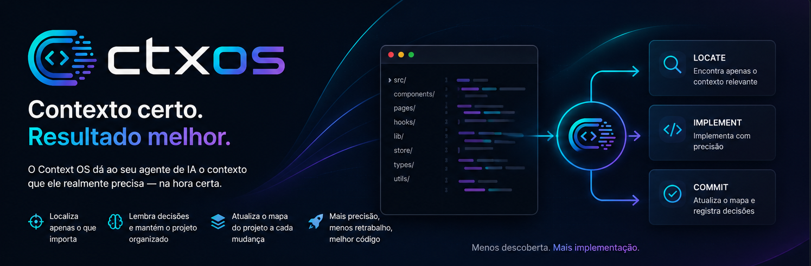

<p align="center">
  
</p>

<p align="center">
  Faça seu agente de IA trabalhar como se já conhecesse seu projeto.
</p>

<p align="center">

[](https://github.com/BrBarboza/Context-OS)
[](LICENSE)


</p>

---

O **Context OS** é um plugin para o Claude Code que cria um mapa inteligente do seu código.

Em vez da IA explorar o projeto inteiro a cada tarefa ou trabalhar "no escuro", o ctxos localiza apenas o contexto necessário, lembra decisões anteriores e mantém esse conhecimento atualizado conforme o projeto evolui.

O resultado é um agente que faz implementações muito mais consistentes em projetos grandes.

---

# Por que existe?

Toda vez que você pede uma alteração para uma IA, ela precisa descobrir coisas como:

- Onde fica essa funcionalidade?
- Quais arquivos estão relacionados?
- O que pode ser alterado?
- Quais decisões arquiteturais já foram tomadas?
- O que não deve ser quebrado?

Sem contexto, boa parte do esforço da IA é simplesmente entender o projeto novamente.

O **Context OS** transforma esse processo em conhecimento permanente.

---

# O que ele faz?

Durante o desenvolvimento ele mantém um mapa vivo do projeto.

A cada implementação ele consegue:

- localizar apenas o código relevante
- evitar procurar arquivos desnecessários
- lembrar decisões já tomadas
- atualizar automaticamente esse conhecimento
- manter a arquitetura consistente conforme o projeto cresce

Na prática, o agente passa a trabalhar como alguém que já conhece a base de código.

---

# Instalação

```bash
/plugin marketplace add BrBarboza/Context-OS
/plugin install ctxos@ctxos
```

---

# Primeiros passos

Indexe o projeto apenas uma vez.

```bash
/ctxos:index
```

Depois escolha como deseja trabalhar.

```bash
/ctxos:manual
```

ou

```bash
/ctxos:autonomous
```

Pronto.

---

# Modo Manual

Você controla cada etapa.

O agente:

- encontra o contexto
- espera autorização
- implementa
- espera autorização
- atualiza o mapa do projeto

Ideal para:

- refatorações delicadas
- debugging
- mudanças arquiteturais
- investigação

Exemplo:

```text
Você

/ctxos:locate "Por que o login falha às vezes?"

↓

ctxos

Arquivos encontrados:
- auth.ts
- login.tsx
- session.ts

Aguardando autorização.

↓

Você

Pode implementar.

↓

ctxos

Implementado.

Aguardando commit.

↓

Você

/ctxos:commit
```

---

# Modo Autônomo

Você conversa normalmente.

Exemplo:

```text
Remove a navbar da tela de checkout.
```

O ctxos executa automaticamente:

```
Locate

↓

Implementação

↓

Commit
```

sem precisar de novos comandos.

Ele só interrompe quando encontra decisões que fogem do código, como:

- banco de dados
- infraestrutura
- CI/CD
- novas dependências
- novos conceitos arquiteturais

Todo o restante ele resolve sozinho.

---

# Perfis da sessão

Além do modo de trabalho, o Context OS tem mais dois eixos independentes de configuração.

```bash
/ctxos:mode manual
/ctxos:mode autonomous

/ctxos:think fast
/ctxos:think normal
/ctxos:think deep

/ctxos:output compact
/ctxos:output verbose
```

- **Mode** — como o agente trabalha. Manual (espera sua autorização) ou Autonomous (orquestra sozinho).
- **Think** — quanto o agente raciocina antes de implementar. `fast` pra mudanças triviais, `normal` é o padrão, `deep` pra decisões arquiteturais complexas.
- **Output** — quanto de detalhe ele devolve pra você. `compact` é um checklist enxuto, `verbose` explica decisões, nós e memória tocados.

Os três são independentes. `mode autonomous` + `think fast` + `output compact` é um perfil válido; `mode manual` + `think deep` + `output verbose` também.

`/ctxos:manual` e `/ctxos:autonomous` continuam funcionando — são atalhos pra `/ctxos:mode manual` e `/ctxos:mode autonomous`.

Pra consultar o estado atual sem procurar nas respostas:

```bash
/ctxos:status
```

```text
Context OS

SESSION
────────────────────────
Mode.............Autonomous
Think............Deep
Output...........Compact

PROJECT
────────────────────────
Index............✓ Atualizado
Nodes............42
Memory...........18 decisões
Last Commit......2 min atrás

RUNTIME
────────────────────────
Locate...........Ativo
Commit...........Ativo
Autonomous.......Ativo
```

Nenhum dos três é salvo em arquivo — sessão nova sempre volta pro padrão (`manual` / `normal` / `verbose`).

---

# Resultados reais

O Context OS foi testado implementando exatamente o mesmo aplicativo com e sem ctxos.

## Claude Code (normal)

- **46 interações**
- **7 minutos e 39 segundos**
- **117,9 mil tokens**
- **US$ 3,32**

Resultado:

Entregou uma boa aplicação, mas ainda exigiria várias horas de ajustes manuais para chegar ao nível esperado.

---

## Claude Code + Context OS

- **91 interações**
- **23 minutos e 12 segundos**
- **381,7 mil tokens**
- **US$ 10,54**

Resultado:

Entregou uma aplicação muito mais refinada, incluindo:

- reorganização da arquitetura
- extração de componentes reutilizáveis
- separação de módulos
- padronização visual
- atualização da documentação
- registro das decisões do projeto
- atualização automática do mapa de contexto

O projeto praticamente não precisava mais de refinamentos.

---

# O que aprendemos

O objetivo inicial era reduzir tokens.

Os testes mostraram exatamente o contrário.

O ctxos consumiu aproximadamente:

- **98% mais interações**
- **203% mais tempo**
- **224% mais tokens**
- **217% mais custo**

Mesmo assim, o resultado final foi significativamente superior.

Enquanto a implementação tradicional entregou um projeto que ainda precisaria de vários dias de refinamento, o projeto desenvolvido com ctxos já saiu praticamente pronto para continuidade.

O custo adicional veio porque o agente passou mais tempo:

- entendendo relações do projeto;
- reorganizando a arquitetura;
- reaproveitando componentes;
- mantendo consistência entre módulos;
- registrando conhecimento para as próximas tarefas.

Em outras palavras:

> **O Context OS não faz a IA trabalhar menos. Faz a IA trabalhar melhor.**

---

# Filosofia

A maioria dos agentes começa cada tarefa quase do zero.

O Context OS mantém um entendimento contínuo do projeto.

Menos redescoberta.

Mais implementação.

Mais consistência.

Mais qualidade.

---

# Roadmap

### Estável

- Indexação do projeto
- Localização inteligente de contexto
- Commit de conhecimento
- Modo Manual
- Modo Autônomo
- Perfis da sessão (`mode` / `think` / `output`)
- Diagnostico de sessao (`status`)

### Experimental

- Doctor
- Adapters
- Integração com LoopTeam

---

# Licença

MIT
